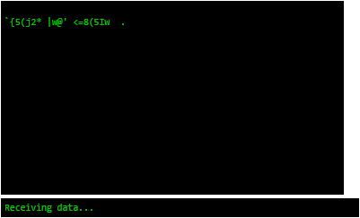
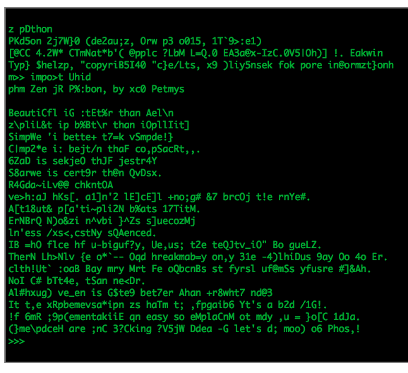

# sneakers.js  [](http://sapegin.github.io/powered-by-you/)

<!--
[](https://travis-ci.org/mar10/sneakers.js)
-->
> JavaScript plugin that simulates tty typing and decryption effect as seen in the
1992 movie [Sneakers](https://youtu.be/F5bAa6gFvLs).

Inspired by Brian Barto's [no-more-secrets](https://github.com/bartobri/no-more-secrets) tool.

Copyright &copy; 2016 Martin Wendt. License: MIT.

Click here for a [demo](https://rawgit.com/mar10/sneakers.js/master/demo/index.html):

[](https://rawgit.com/mar10/sneakers.js/master/demo/index.html)
<!--
[](https://rawgit.com/mar10/sneakers.js/master/demo/index.html)
-->


### Usage

Include <a href="http://jquery.com">jQuery</a> and
<a href="https://github.com/mar10/sneakers.js/blob/master/dist/sneakers.min.js">`sneakers.min.js`</a>
and initialize the plugin

```js
$(".sneakers").sneakers({
	lockSize: true,  // lock current element size before removing content
	done: function() {
		alert("done");  // optionally handle events
	}
});
```

this will remove the content of the target element, then 'type' it in in an 'encrypted'
version, and then 'decrypt' the text:

```html
<p class="sneakers">
The Zen of Python, by Tim Peters

Beautiful is better than ugly.
Explicit is better than implicit.
</p>
```

Some CSS rules can help to maintain line breaks and prevent wobbling:

```css
.sneakers {
	/* A monospaced font prevents wobbling */
	font-family: Consolas, "Andale Mono", "Courier New", monospace;
	/* Preserve newlines in plain text */
	white-space: pre;
}
```


### API

Following all options with their defaults:

```js
$(".sneakers").sneakers({
	typeSpeedMs: 4,          // milliseconds per 'keystroke' (0: no typing simulation)
	jumbleDurationMs: 2000,  // duration of jumble phase [ms] (0: no jumble phase)
	jumbleSpeedMs: 35,       // milliseconds per jumble update
	decodeDurationMs: 5000,  // duration of decoding phase [ms] (0: no decryption simulation)
	decodeSpeedMs: 100,      // milliseconds per update
	stopEps: 0.01,           // decode the rest if less than 1% are encrypted
	lockSize: false,         // lock current element size before removing content
	// Events:
	start: $.noop,           // Current text was replaced by encrypted text
	type: $.noop,            // 'Encrypted' text has been typed to screen
	done: $.noop             // Decrypted text is completely displayed
});
```
